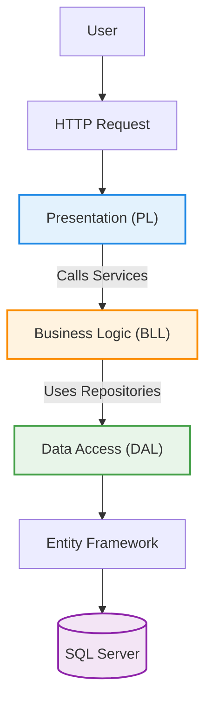

# KEshop – ASP.NET Core E-Commerce Platform

## 📌 Overview

 a full-featured, multi-layered E-Commerce web application built using **ASP.NET Core (.NET 9)** and **Entity Framework Core**.

The system follows modern backend architecture principles including:

- 3-Tier Architecture (PL, BLL, DAL)
- Repository Pattern
- Service Layer Pattern
- DTO Pattern
- ASP.NET Core Identity
- Stripe Payment Integration
- JWT Authentication
- Clean Architecture Principles

This project demonstrates real-world backend development practices and scalable system design.

---

## Architecture

The application follows a structured **3-Layer Architecture**:

```

Ecommerce
│
├── .PL → Presentation Layer (Web / MVC)
├── .BLL → Business Logic Layer (Services)
├── .DAL → Data Access Layer (EF Core + Repositories)
└── .sln

```

---

##  Architecture Diagram


---

## Project Structure

### Presentation Layer – `Ecom.PL`
#### Handles:
- API Controllers
- Identity Configuration
- JWT Authentication
- Stripe configuration
- CORS Policies
- Email settings
- Static files (`wwwroot/images`)

### Business Logic Layer – Ecom.BLL
Implements application business rules using service classes and interfaces.

####  Example Services
- AuthenticationService
- ProductService
- CategoryService
- BrandService
- CartService
- CheckOutService
- OrderService
- ReviewService
- ReportService
- UserService
- FileService

#### This layer ensures:
- Validation
- Business rules enforcement
- Separation from database logic

### Data Access Layer – Ecom.DAL
#### Implements:
- Entity Framework Core
- ApplicationDbContext
- Repository Pattern
- DTOs (Requests / Responses)
- Seed Data
- Migrations

#### Core Models
- ApplicationUser
- Product
- Category
- Brand
- Cart
- Order
- OrderItem
- ProductImage
- Review
---

## Key Features

### Authentication & Authorization
- ASP.NET Core Identity
- JWT Bearer Authentication
- Role-Based Authorization
- Email Confirmation Required
- Account Lockout Protection

### Product & Catalog Management
- Create / Update / Delete Products
- Category & Brand Management
- Product Image Upload

### Shopping Cart
- Add to Cart
- Update Quantity
- Cart Summary

### Checkout & Payment
- Stripe Integration
- Secure Payment Session
- Order Creation After Payment

### Order Management
- Order Tracking
- Order Items
- Admin Order Control
- Order Status Handling

### Reviews System
- Add Reviews
- Product Rating System

### PDF Reporting
- Generate dynamic PDF reports using QuestPDF

### File Upload System
- Single & Multiple Image Upload
- Stores files inside `wwwroot/images`
- Uses GUID-based naming to prevent duplication
- Asynchronous file handling

---

##  JWT Authentication

This API uses **JWT Bearer Authentication** for securing endpoints.

After a successful login, the API returns a JWT token.

To access protected endpoints, include the token in the request header:

```
Authorization: Bearer {your_token}
```
Token validation includes:

- Lifetime validation
- Signing key validation
- Role-based authorization

---

## System Design

### Architectural Style
The system uses Layered Architecture (3-Tier) to ensure:
- Separation of Concerns
- Maintainability
- Testability
- Scalability

---
### Design Patterns Used

- **Repository Pattern**  
  Abstracts database operations from business logic.

- **Service Layer Pattern**  
  Encapsulates business logic inside services.

- **DTO Pattern**  
  Separates domain models from request/response contracts.

- **Dependency Injection**  
  Uses built-in ASP.NET Core DI container.

- **Identity Pattern**  
  Implements authentication and role management.

---

### Database Relationships
- One Category → Many Products
- One Product → Many Reviews
- One Order → Many OrderItems
- One User → Many Orders
- One Product → Many ProductImages

---

### Payment Flow (Stripe)
1. Customer adds items to cart
2. Proceeds to checkout
3. Stripe session is created
4. Payment processed
5. Order stored in database
6. Cart cleared

---

## Technologies Used
- ASP.NET Core (.NET 9)
- C#
- Entity Framework Core
- SQL Server
- ASP.NET Core Identity
- JWT Bearer Authentication
- Mapster (Object Mapping)
- Stripe.net (Payment Integration)
- QuestPDF (PDF Report Generation)
- Repository Pattern
- Service Layer Pattern
- Git & GitHub

---
## Prerequisites

Make sure you have the following installed:

- .NET 9 SDK
- SQL Server
- Visual Studio 2022 (17.8+)
- Entity Framework CLI Tools (`dotnet tool install --global dotnet-ef`)

---

## Installation & Setup
1. Clone the Repository
   
```
git clone https://github.com/YOUR_USERNAME/EEcommerce.git

```

2.  Configure Database
Update connection string in `appsettings.json` .

Then run:
```bash
dotnet ef database update

```
3. Configure Stripe
Inside `appsettings.json`:

```json
"Stripe": {
  "SecretKey": "YOUR_SECRET_KEY",
  "PublishableKey": "YOUR_PUBLISHABLE_KEY"
}

```
4.  Run the Application

```bash
dotnet run

```
Or run from Visual Studio.

## 🌐 API Documentation & Preview

This project is a RESTful API with interactive documentation.

When running in development mode, you can access:

- OpenAPI Specification:  
  https://localhost:5001/openapi/v1.json

- Scalar API Documentation UI:  
  https://localhost:5001/scalar

You can test all endpoints directly from the Scalar UI.

---

## 📸 API Screenshots

### 🔹 API Overview (Scalar UI)

### 🔹 JWT Authentication Example

### 🔹 Stripe Checkout Example

---

## Security Considerations
- JWT Authentication
- Role-based authorization
- Password Policy Enforcement
- DTO validation
- Secure configuration management
- Stripe secure API usage


## Develped by:

**Omar Alhamdan**

Computer Systems Engineering Student

ASP.NET Core Developer
